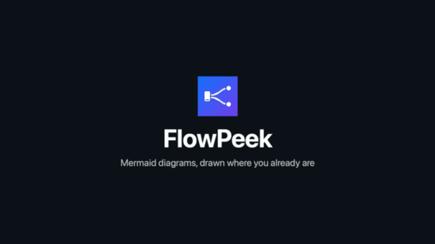
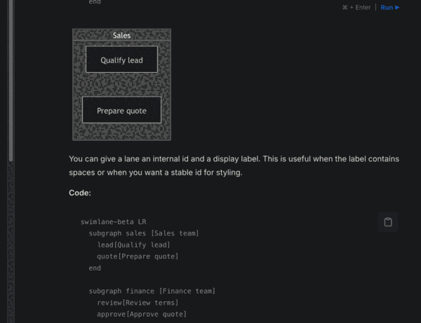
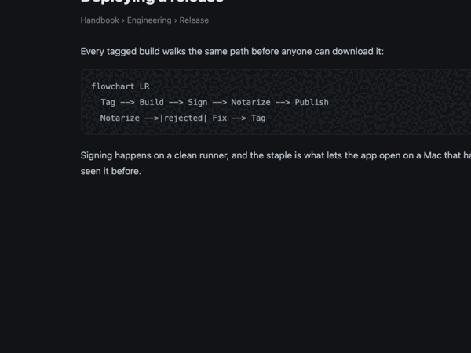
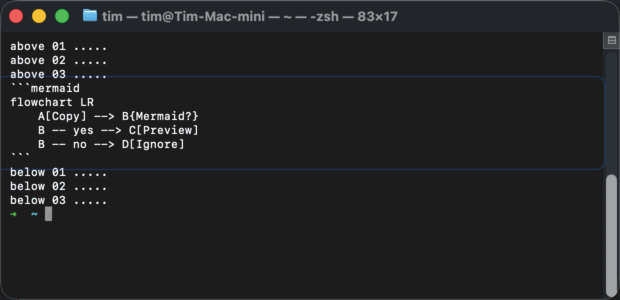
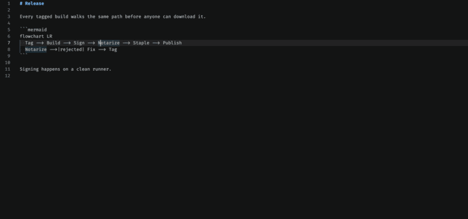
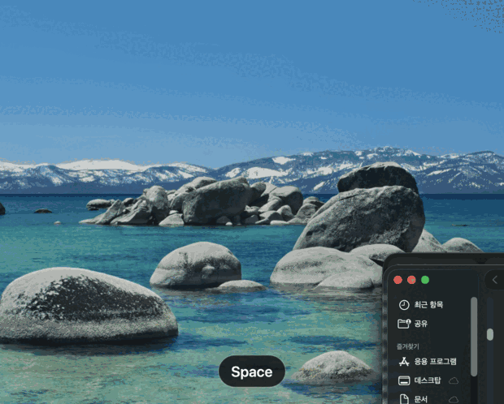

<div align="center">
  
  <h1>FlowPeek</h1>
  <p><strong>You are reading a Mermaid diagram as source code. Stop doing that.</strong></p>
  <p>
    Point at Mermaid anywhere on your Mac — a docs page, a pull request, your editor —<br>
    and it draws, right there. Free, open source, and nothing leaves your Mac.
  </p>
  <p>
    <a href="https://github.com/FlowPeek/flowpeek/releases/latest"></a>
    
    <a href="LICENSE"></a>
  </p>
  <p>
    <a href="#install"><b>Install</b></a> ·
    <a href="#ways-to-see-a-diagram">Ways in</a> ·
    <a href="#the-shelf">The shelf</a> ·
    <a href="#privacy">Privacy</a>
  </p>
</div>

<p align="center">
  
</p>
<p align="center">
  <sub><a href="https://flowpeek.github.io/flowpeek/#tour">Watch the same tour at full size</a></sub>
</p>

```sh
brew install --cask flowpeek/tap/flowpeek
```

## Ways to see a diagram

**Hold ⌥ and point at it.** The block is outlined where it sits. Press Space and it draws. The
gesture is off until you switch it on: Setup offers it once Accessibility has been granted, and
Settings carries the same switch.



**Copy it.** A badge appears near the menu bar and names the key that opens it.


**Select it.** A small button appears beside the selection.



**Print it in a terminal.** A diagram in Terminal, iTerm2 or Ghostty gets a faint frame where it
sits, one for each on screen. Bring the pointer near and that one brightens; hold ⌥ and the block
opens on a click. Nothing to select, nothing to copy — and the frame goes when the block scrolls
off screen.

This is the case the terminal support was written for: a coding agent such as Claude Code or Codex
printing a diagram into the scrollback. There is no file to open, because nothing was ever written
to disk, and there is nothing clean to select either, because the terminal has already broken the
block across its own line wraps. FlowPeek joins those rows back together before it draws. Asking
the agent to render it instead costs a round trip, a file to open, and a file to delete.

A program that has taken the whole screen is read too, in Ghostty: vim, `less`, `lazygit`, or that
same agent's own full-screen interface. Nothing has to have scrolled past first — FlowPeek asks the
terminal how big its grid is rather than working it out from what has already been printed.



Editors work too. In VS Code the outline follows the caret, because an editor can say where the caret is but not where the pointer is. VS Code needs one setting turned on first — see [Questions](#questions):



## In Finder

FlowPeek installs a Quick Look extension, so a `.mmd` or `.mermaid` file is a diagram when you press
the space bar — no app to open, no window to switch to. **Double-click one** and it opens in a
preview window rather than a text editor; FlowPeek is a viewer for these and never writes to them,
and if you would rather edit, Get Info → Open with is one change away.

<p align="center">
  
</p>

## The shelf

Every diagram FlowPeek draws is kept. ⌥⇧⌘H raises a shelf of them — as pictures, because that is
how you recognise the one you meant — with the search field already focused.

<p align="center">
  
</p>

Type to search. The words in a diagram find it outright; when nothing matches, the shelf offers the
three closest **in meaning** and says that is what they are — computed on your Mac, by the language
model macOS already ships.

Everything on it works from the keyboard: `↑↓←→` to move, `⏎` to open, `⌘C` to copy the Mermaid,
`⌫` to forget, `⌘1`–`⌘9` to jump, `esc` to back out one step at a time.

## What else it does

- **Zoom and pan** with the trackpad, or from the keyboard once the window has focus.
- **Take it with you** — copy the diagram as an image, or save it as PNG, PDF or SVG.
- **Put it on the glass or on its own canvas**, whichever reads better against what is behind it.
- **Keep the size** you dragged it to; the next diagram opens the same way.
- **Ask for one** — describe a diagram and let a model you supply the key for write the Mermaid.
  Off until you switch it on.

## Where this sits

A diagram gets written once and read many times. Three different tools, one for each part of that:

1. **Write it.** [Mermaid](https://mermaid.js.org) is the notation. You type it into a pull
   request, a README, a design doc.
2. **Or have it made.** [Archify](https://github.com/tt-a1i/archify) and generators like it turn a
   codebase or a description into a diagram you can keep and send.
3. **Then read it, again and again.** That is this app. Writing happens once. Reading happens every
   time anyone opens that pull request.

|  | Mermaid | Archify and other generators | FlowPeek |
| --- | --- | --- | --- |
| **What it is** | a notation | a maker | a viewer |
| **Reach for it when** | you are writing a diagram | you have no diagram yet | one is already on your screen |
| **Your agent just printed one** | that is what it printed | ask it for a file, then open the file | it is framed where it printed |
| **You end up with** | text you can commit | a file to keep and send | a look, then nothing |
| **What it needs** | nothing | an AI agent | one macOS permission |

None of these substitutes for another. FlowPeek is not a Mermaid alternative in particular: Mermaid
is what it reads, and a copy of it is bundled in the app. The nearest the three come to touching is
a Mermaid block an agent has just printed into your terminal, where a generator would build a new
artifact from it and FlowPeek draws the one already on the screen.

## Install

```sh
brew install --cask flowpeek/tap/flowpeek
```

Or download the notarized disk image from [the latest release](https://github.com/FlowPeek/flowpeek/releases/latest).

FlowPeek asks for Accessibility permission on first launch, because reading the text you are pointing
at is the whole feature. If you would rather not grant it, say no: copying a diagram still works, and
the app says so instead of pretending to be broken.

Releases are built, signed and notarized by `.github/workflows/release.yml` on every `v*` tag; see
[docs/RELEASING.md](docs/RELEASING.md).

## Privacy

- The text you point at, and the terminal buffer around a diagram on screen, are read into memory
  and never logged.
- Two other things are read, and neither is written to: in Ghostty, the terminal's pty is opened
  read-only and asked its size with a single `ioctl` — no byte is ever read from it — and when a
  gesture finds nothing in VS Code or a fork of it, that editor's `product.json` and your
  `settings.json` for it are read to see whether `editor.accessibilitySupport` is the reason.
- The diagrams FlowPeek actually draws are saved on your Mac, in Application Support — the source
  and a small picture of each — so the shelf can offer them back. Nothing else is: a selection that
  was never previewed is never written down. Switching the history off, or clearing it, deletes
  both, and you can cap it by count, by age, or turn it off entirely.
- Nothing is sent anywhere unless you use the AI experiment, which is off until you switch it on and
  sends only when you press Generate. Searching by meaning runs on your Mac.
- Mermaid is bundled, so drawing a diagram makes no network request at all.
- Only Accessibility is requested. Not Screen Recording, not Input Monitoring.
- The Quick Look extension is sandboxed and declares the network client entitlement, which is the
  only way WebKit will start inside a sandbox at all — measured: without it the preview page never
  loads and no navigation callback ever arrives. It buys the right to launch WebKit's helper
  processes, not the ability to fetch: the preview document carries `default-src 'none'`, Mermaid is
  a local script, and there is no URL in it to load.

## Questions

### FlowPeek sees nothing in VS Code. Why?

Because VS Code does not hand its text to macOS until you ask it to. Turn on **Toggle Screen Reader
Accessibility Mode** from the Command Palette, or set `editor.accessibilitySupport` to `on` in
settings, and reload the window.

FlowPeek says so now rather than leaving you to find this page. A gesture that finds nothing in VS Code, or in a
fork of it, puts up a badge naming the editor and that one setting, at most twice in a run. To
tell "there is no diagram here" from "this editor hands out nothing", it reads two of the editor's
own files and writes to neither: the `product.json` inside the application bundle, which names the
editor and the directory it files data under, and that editor's own `settings.json`, for the value
of `editor.accessibilitySupport`. If the setting is already `on`, nothing is said at all. The
product file is what identifies the editor, rather than a list of bundle identifiers, so the forks
come along with it — Cursor, Antigravity, Trae, Kiro, Positron, Void and VSCodium ship the same
setting, the same default and the same silence.

The setting ships as `auto`, which means "on when a screen reader is running". FlowPeek is not a
screen reader and cannot answer to that, so on a default install the editor's accessibility node is
an empty group: measured, the focused element is an `AXGroup` carrying zero characters, and it stays
that way whatever FlowPeek asks it. With the setting on, the same element is an `AXTextArea` holding
the whole document — a 126-line file came back complete, 10,064 characters of it.

This is VS Code's own switch and only you can throw it. Nothing else in FlowPeek is affected: the
terminal, the clipboard, Finder and every ordinary application read the same either way.

### Does Sublime Text work?

Yes, with a small plugin FlowPeek offers to install for you. Setup notices Sublime on your Mac and
asks; you can read the file before anything is written, and Settings ▸ Integrations turns it off
again and deletes it.

The plugin is there because Sublime draws its own text and puts none of it in the accessibility
tree. Measured: the focused element is the window itself, the whole window exposes two pieces of
static text — the tab title and the status line — and `AXSelectedText`, `AXValue` and
`AXSelectedTextRange` are all absent. There is no setting to turn on, the way VS Code has one. What
Sublime does have is a plugin API that answers the two questions the accessibility API will not:
which characters are on screen, and where a range of them sits. So the plugin answers exactly those
two, only while FlowPeek is asking, and nothing else.

That protocol is published rather than private: any application can speak it and FlowPeek will watch
it, whether or not FlowPeek has ever heard of the application. See
[docs/INTEGRATIONS.md](docs/INTEGRATIONS.md) if you want your own editor read this way.

If you would rather install nothing, copy the diagram instead. That route needs no permission at all
and works everywhere, because a copy is the one signal every application emits.

### It draws nothing in my terminal, or in some other app

Terminal, iTerm2 and Ghostty are read directly, a program that has taken the whole screen included.
That last one is not solved out of the scrollback but asked for: FlowPeek opens Ghostty's pty
read-only and issues one `ioctl(TIOCGWINSZ)` to ask how many rows and pixels it has — measured, 40
rows in 1280 pixels, which is 32 device pixels a row and 16.000 points at a backing scale of 2. No
byte is ever read from the device, and only Ghostty is asked; Terminal.app and iTerm2 answer
per-character geometry directly and never reach that code. So vim, `less` or a coding agent's
interface is framed on the first look, with nothing printed beforehand.

Otherwise the reason is Sublime's, usually. A terminal that paints its text into a canvas, such as
the one inside VS Code, exposes none of it and there is nothing FlowPeek can do there. Copying works
there all the same, and an application that wants to be read properly can speak the integration
protocol in [docs/INTEGRATIONS.md](docs/INTEGRATIONS.md).

## Requirements

- macOS 14 or later (Apple Silicon and Intel)
- Xcode 26 or later for development
- Node.js only when refreshing the vendored Mermaid asset
- A Developer ID Application certificate for direct distribution

## Build

The checked-in Xcode project builds a real menu-bar `.app`:

```sh
xcodebuild -project FlowPeek.xcodeproj -scheme FlowPeek \
  -derivedDataPath /private/tmp/flowpeek-derived \
  build
```

Core and application compile tests can also run through Swift Package Manager:

```sh
swift test
```

The renderer tests need the app host (they drive the real WKWebView, page and glue), so they run under
`xcodebuild … test`. Two of them consume checked-in fixtures:

- `Tests/Fixtures/detector_corpus.json` is shared with `npm run conformance`, which replays it through
  the vendored bundle's own `mermaid.detectType()`. A re-vendored Mermaid whose detector regexes moved
  fails on one side or the other rather than drifting silently.
- `Tests/Fixtures/golden/` holds normalised SVG snapshots per diagram type and appearance. Re-record
  them with `TEST_RUNNER_FLOWPEEK_RECORD_GOLDEN=1 xcodebuild … test` — the correct response to a
  deliberate Mermaid or theme change, and the wrong response to an unexplained diff.

Debug builds use a valid local bundle signature so macOS can grant Accessibility permission even when an Apple Development certificate is unavailable or not trusted. Release builds preserve the configured Development Team and require its valid Developer ID certificate as described below.

`FlowPeek.xcodeproj` is generated by `ruby Scripts/generate_xcodeproj.rb`. Run it after adding or removing source files. It activates the `xcodeproj` version it pins and tells you what to install if that version is absent: the output is deterministic only for a fixed version, and the release workflow rejects a project that does not match. Mermaid 11.17.2 is pinned and copied into the app; refresh it with `npm install && npm run vendor:mermaid`.

## Permissions and privacy, in detail

FlowPeek requests only macOS Accessibility permission, and uses it to read the text under the pointer
or in the selection along with its bounds. It does not request Screen Recording or Input Monitoring.
What it reads stays in memory and is never logged; the only thing written to disk is a diagram it
actually drew, and only while you keep the history (see [Privacy](#privacy) above). AI context leaves
the machine only when Generate is pressed, and provider keys live in the macOS Keychain.

Because cross-application Accessibility access is incompatible with the intended sandbox model, the distribution target has App Sandbox disabled and Hardened Runtime enabled. Distribute a Developer ID–signed, notarized, stapled DMG rather than a Mac App Store build.

## Renderer security

- Mermaid is bundled; no CDN and no remote renderer.
- It runs with `securityLevel: strict` in a page whose CSP is `default-src 'none'`, so nothing a
  diagram contains can fetch, navigate or execute. `sandbox` was tried first and returns an iframe
  that same CSP blocks, which is why the level is `strict` and the engine is injected as a user
  script into its own content world instead.
- Limits: 120,000 characters and 2,000 edges at the engine, and 100,000 characters, 5,000 lines and
  20,000 characters per line before a source is handed to it.
- Every rendered SVG is swept before it is shown: scripts, frames, external references and event
  handlers are removed, `<foreignObject>` labels are reduced to the tags a label is made of, and the
  theme's own `<style>` is dropped whole if a value carried an `@import` or an off-document `url()`
  out of its declaration.
- The `WKWebView` uses a non-persistent data store, denies user-initiated navigation and disables
  `window.open`.
- A diagram chooses its own palette: front matter, `%%{init}%%`, `themeVariables`, `classDef`,
  `style` and `linkStyle` are all authoritative. `themeCSS` is not — that one is raw CSS rather than
  values, and the theme's stylesheet is the one thing the sweep keeps. Diagrams that name no colours
  get semantic light/dark macOS colours and system typography.

## AI experiment

Off until you switch it on. Enable it in Settings, save a provider key — it goes to the macOS
Keychain — then select any text and press the AI shortcut. The provider must answer with
`{ title, mermaid, notes }`, and FlowPeek validates the Mermaid locally before drawing it. Nothing is
ever re-sent on your behalf: an answer that will not draw offers a repair you can read before you
send it.

The default model identifiers are `gpt-5.6-terra`, `claude-sonnet-5` and `gemini-3.7-flash`.
Availability depends on your own provider account.

## Release setup

Before shipping:

1. Set `DEVELOPMENT_TEAM` and the Developer ID signing identity.
2. Archive and export the app, then run `Scripts/notarize_dmg.sh` with the environment variables documented in that script.
3. Publish an EdDSA-signed Sparkle appcast. `Updates/appcast.xml.example` shows the required shape.

Sparkle checks `https://github.com/FlowPeek/flowpeek/releases/latest/download/appcast.xml` once a day. GitHub redirects that path to the newest release, and the release workflow re-uploads the appcast on every tag, so no separate hosting is involved. Updates are EdDSA-signed with the key whose public half is in `Config/Info.plist`; the private half lives only in the `SPARKLE_PRIVATE_KEY` secret and the author's keychain.

## Source layout

- `Sources/FlowPeekCore`: pure validation, theme, document, and AI data models
- `Sources/FlowPeek`: AppKit/SwiftUI app, Accessibility reader, panels, WebKit renderer, Keychain, and provider adapters
- `Sources/FlowPeek/Resources`: English/Korean localization and vendored Mermaid
- `Tests/FlowPeekCoreTests`: deterministic core behavior tests
- `Tests/FlowPeekRendererTests`: app-hosted renderer conformance, golden and adversarial tests
- `Tests/Fixtures`: the shared detector corpus and the golden SVG snapshots

## Third-party software

FlowPeek itself is MIT licensed; see [LICENSE](LICENSE). Mermaid 11.17.2 and Sparkle 2.9.2 are MIT licensed. See `THIRD_PARTY_NOTICES.md` and their upstream distributions for full license texts.
