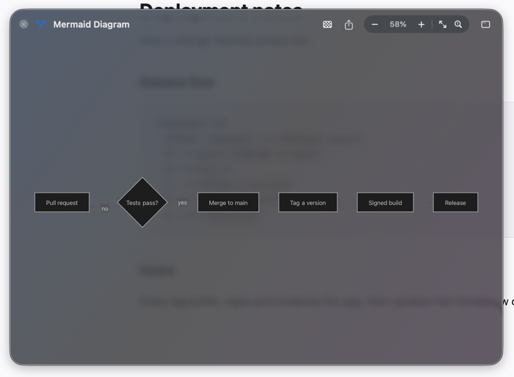
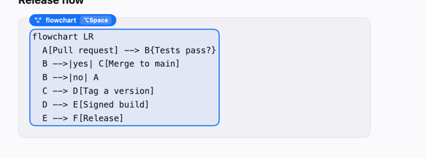
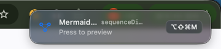
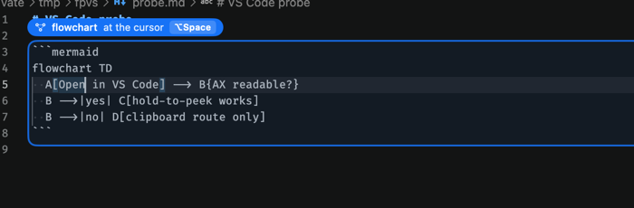

<div align="center">
  
  <h1>FlowPeek</h1>
  <p><strong>See the Mermaid diagram you are looking at, without leaving the page.</strong></p>
  <p>A macOS menu-bar app. Point at Mermaid source anywhere — a docs page, a pull request, your editor — and it draws.</p>
</div>

<p align="center">
  
</p>

## Three ways to see a diagram

**Hold ⌥ and point at it.** The block is outlined where it sits. Press Space and it draws.



**Copy it.** A badge appears near the menu bar and names the key that opens it.



**Select it.** A small button appears beside the selection.

Editors work too. In VS Code the outline follows the caret, because an editor can say where the caret is but not where the pointer is:



## What you can do with it

- **Zoom and pan** with the trackpad, or from the keyboard once the window has focus.
- **Take it with you** — copy the diagram as an image, or save it as PNG, PDF or SVG.
- **Put it on the glass or on its own canvas**, whichever reads better against what is behind it.
- **Keep the size** you dragged it to; the next diagram opens the same way.

## Install

```sh
brew install --cask flowpeek/tap/flowpeek
```

Or download the notarized disk image from [the latest release](https://github.com/FlowPeek/flowpeek/releases/latest).

FlowPeek asks for Accessibility permission on first launch, because reading the text you are pointing
at is the whole feature. If you would rather not grant it, say no: copying a diagram still works, and
the app says so instead of pretending to be broken.

Releases are built, signed and notarized by `.github/workflows/release.yml` on every `v*` tag; see
[docs/RELEASING.md](docs/RELEASING.md).

## Privacy

- The text you point at is read into memory and never written to disk or logged.
- Nothing is sent anywhere unless you use the AI experiment, which is off until you switch it on and
  sends only when you press Generate.
- Mermaid is bundled, so drawing a diagram makes no network request at all.
- Only Accessibility is requested. Not Screen Recording, not Input Monitoring.

## Requirements

- macOS 14 or later (Apple Silicon and Intel)
- Xcode 26 or later for development
- Node.js only when refreshing the vendored Mermaid asset
- A Developer ID Application certificate for direct distribution

## Build

The checked-in Xcode project builds a real menu-bar `.app`:

```sh
xcodebuild -project FlowPeek.xcodeproj -scheme FlowPeek \
  -derivedDataPath /private/tmp/flowpeek-derived \
  build
```

Core and application compile tests can also run through Swift Package Manager:

```sh
swift test
```

The renderer tests need the app host (they drive the real WKWebView, page and glue), so they run under
`xcodebuild … test`. Two of them consume checked-in fixtures:

- `Tests/Fixtures/detector_corpus.json` is shared with `npm run conformance`, which replays it through
  the vendored bundle's own `mermaid.detectType()`. A re-vendored Mermaid whose detector regexes moved
  fails on one side or the other rather than drifting silently.
- `Tests/Fixtures/golden/` holds normalised SVG snapshots per diagram type and appearance. Re-record
  them with `TEST_RUNNER_FLOWPEEK_RECORD_GOLDEN=1 xcodebuild … test` — the correct response to a
  deliberate Mermaid or theme change, and the wrong response to an unexplained diff.

Debug builds use a valid local bundle signature so macOS can grant Accessibility permission even when an Apple Development certificate is unavailable or not trusted. Release builds preserve the configured Development Team and require its valid Developer ID certificate as described below.

`FlowPeek.xcodeproj` is generated by `ruby Scripts/generate_xcodeproj.rb`. Run it after adding or removing source files. It activates the `xcodeproj` version it pins and tells you what to install if that version is absent: the output is deterministic only for a fixed version, and the release workflow rejects a project that does not match. Mermaid 11.17.2 is pinned and copied into the app; refresh it with `npm install && npm run vendor:mermaid`.

## Permissions and privacy

FlowPeek requests only macOS Accessibility permission, and uses it to read the text under the pointer
or in the selection along with its bounds. It does not request Screen Recording or Input Monitoring.
What it reads stays in memory: it is never logged and never written to disk. AI context leaves the
machine only when Generate is pressed, and provider keys live in the macOS Keychain.

Because cross-application Accessibility access is incompatible with the intended sandbox model, the distribution target has App Sandbox disabled and Hardened Runtime enabled. Distribute a Developer ID–signed, notarized, stapled DMG rather than a Mac App Store build.

## Renderer security

- Mermaid is bundled; no CDN and no remote renderer.
- It runs with `securityLevel: strict` in a page whose CSP is `default-src 'none'`, so nothing a
  diagram contains can fetch, navigate or execute. `sandbox` was tried first and returns an iframe
  that same CSP blocks, which is why the level is `strict` and the engine is injected as a user
  script into its own content world instead.
- Limits: 120,000 characters and 2,000 edges at the engine, and 100,000 characters, 5,000 lines and
  20,000 characters per line before a source is handed to it.
- Every rendered SVG is swept before it is shown: scripts, frames, external references and event
  handlers are removed, `<foreignObject>` labels are reduced to the tags a label is made of, and the
  theme's own `<style>` is dropped whole if a value carried an `@import` or an off-document `url()`
  out of its declaration.
- The `WKWebView` uses a non-persistent data store, denies user-initiated navigation and disables
  `window.open`.
- A diagram chooses its own palette: front matter, `%%{init}%%`, `themeVariables`, `classDef`,
  `style` and `linkStyle` are all authoritative. `themeCSS` is not — that one is raw CSS rather than
  values, and the theme's stylesheet is the one thing the sweep keeps. Diagrams that name no colours
  get semantic light/dark macOS colours and system typography.

## AI experiment

Off until you switch it on. Enable it in Settings, save a provider key — it goes to the macOS
Keychain — then select any text and press the AI shortcut. The provider must answer with
`{ title, mermaid, notes }`, and FlowPeek validates the Mermaid locally before drawing it. Nothing is
ever re-sent on your behalf: an answer that will not draw offers a repair you can read before you
send it.

The default model identifiers are `gpt-5.6-terra`, `claude-sonnet-5` and `gemini-3.7-flash`.
Availability depends on your own provider account.

## Release setup

Before shipping:

1. Set `DEVELOPMENT_TEAM` and the Developer ID signing identity.
2. Archive and export the app, then run `Scripts/notarize_dmg.sh` with the environment variables documented in that script.
3. Publish an EdDSA-signed Sparkle appcast. `Updates/appcast.xml.example` shows the required shape.

Sparkle checks `https://github.com/FlowPeek/flowpeek/releases/latest/download/appcast.xml` once a day. GitHub redirects that path to the newest release, and the release workflow re-uploads the appcast on every tag, so no separate hosting is involved. Updates are EdDSA-signed with the key whose public half is in `Config/Info.plist`; the private half lives only in the `SPARKLE_PRIVATE_KEY` secret and the author's keychain.

## Source layout

- `Sources/FlowPeekCore`: pure validation, theme, document, and AI data models
- `Sources/FlowPeek`: AppKit/SwiftUI app, Accessibility reader, panels, WebKit renderer, Keychain, and provider adapters
- `Sources/FlowPeek/Resources`: English/Korean localization and vendored Mermaid
- `Tests/FlowPeekCoreTests`: deterministic core behavior tests
- `Tests/FlowPeekRendererTests`: app-hosted renderer conformance, golden and adversarial tests
- `Tests/Fixtures`: the shared detector corpus and the golden SVG snapshots

## Third-party software

Mermaid 11.17.2 and Sparkle 2.9.2 are MIT licensed. See `THIRD_PARTY_NOTICES.md` and their upstream distributions for full license texts.
